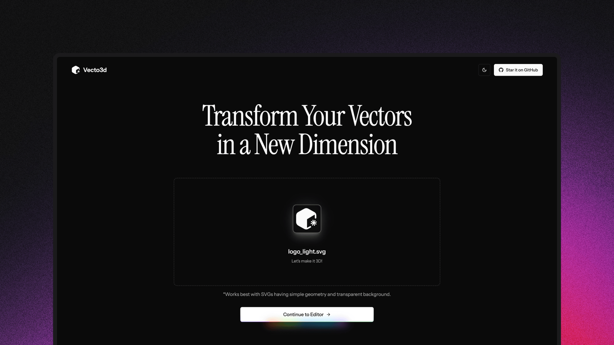

<h1 align="center">3D Designer</h1>

<p align="center">


</p>



**Free Online 3D Logo Maker & SVG to 3D Converter**

Transform your 2D designs into stunning 3D models instantly. Professional-grade 3D logo creation, completely free and running entirely in your browser.

🌐 **Live Demo:** [https://3dlogo.site](https://3dlogo.site)

## 🚀 Features

**Core Functionality:**
- ✨ **SVG to 3D Conversion** - Upload any SVG and instantly convert to 3D
- 🖼️ **Image to SVG Converter** - Convert JPG, PNG, and other images to SVG vectors first
- 🎨 **Material System** - Professional materials including metal, glass, plastic
- 💡 **Dynamic Lighting** - Studio lighting presets and custom environments  
- 🎛️ **Real-time Controls** - Adjust depth, beveling, colors, and more
- 📁 **Multi-format Export** - STL, GLB, GLTF, and high-res PNG export
- 🎬 **Animated GIF Export** - Export rotating 3D models as animated GIFs (when auto-rotate is enabled)
- 🔒 **Privacy First** - All processing happens in your browser
- 🚀 **IndexNow Integration** - Automatic search engine indexing for faster discovery

**SEO Optimized Multi-page Website:**
- 🏠 **Home Page** - Optimized landing page with key SEO terms
- 📖 **About Page** - Company story and mission
- ⚡ **Features Page** - Detailed feature breakdown
- 🔄 **Convert Page** - Image to SVG conversion tool
- 🖼️ **Gallery Page** - Showcase of 3D logo examples
- 📚 **Tutorials Page** - Learning resources and guides
- 📞 **Contact Page** - Support and business inquiries
- ⚖️ **Legal Pages** - Terms of Service and Privacy Policy

## 🏗️ Project Structure

```
3d-designer/
├── app/                    # Next.js App Router
│   ├── about/              # About page
│   ├── contact/            # Contact page  
│   ├── edit/               # 3D logo editor
│   ├── features/           # Features overview
│   ├── gallery/            # Logo gallery
│   ├── privacy/            # Privacy policy
│   ├── terms/              # Terms of service
│   ├── tutorials/          # Learning resources
│   ├── layout.tsx          # Root layout with navigation
│   ├── page.tsx            # Home page
│   ├── sitemap.ts          # SEO sitemap
│   └── robots.ts           # Search engine robots
├── components/             # React components
│   ├── ui/                 # UI components (shadcn/ui)
│   ├── controls/           # 3D editor controls
│   ├── navigation.tsx      # Site navigation
│   └── footer.tsx          # Site footer
├── lib/                    # Libraries and utilities
├── hooks/                  # Custom React hooks
├── public/                 # Static assets
└── styles/                 # Global styles
```

## 🎯 SEO Strategy

**Target Keywords:**
- Primary: `3d logo maker`, `free logo creator`, `svg to 3d converter`
- Long-tail: `free online 3d logo maker`, `convert svg to 3d model`, `professional logo creator`

**SEO Optimizations:**
- ✅ **Multi-page Architecture** - Dedicated pages for better keyword targeting
- ✅ **Optimized Meta Tags** - Title, description, keywords for each page
- ✅ **Structured Data** - Schema markup for better search visibility
- ✅ **Dynamic Sitemap** - Auto-generated XML sitemap
- ✅ **Robots.txt** - Proper search engine crawling instructions
- ✅ **Internal Linking** - Strategic cross-page linking for SEO juice
- ✅ **Content Strategy** - SEO-friendly content across all pages

## 🚀 Quick Start

```bash
# Install dependencies
npm install

# Run development server
npm run dev

# Build for production
npm run build

# Start production server
npm start
```

Visit `http://localhost:3000` to see the application.

## 🛠️ Tech Stack

- **Framework:** Next.js 15 (App Router)
- **Language:** TypeScript
- **3D Graphics:** Three.js, React Three Fiber
- **UI Components:** shadcn/ui, Radix UI
- **Styling:** Tailwind CSS
- **Animations:** Framer Motion
- **State Management:** Zustand
- **SEO & Indexing:** IndexNow Protocol
- **Deployment:** Vercel

## 📈 SEO Performance

The multi-page architecture targets key search terms:

- **Home Page** (`/`) - "free 3d logo maker", "svg to 3d converter"
- **Features** (`/features`) - "3d logo maker features", "professional logo tools"
- **Gallery** (`/gallery`) - "3d logo examples", "logo design inspiration"
- **Tutorials** (`/tutorials`) - "3d logo tutorial", "svg conversion guide"
- **About** (`/about`) - "about 3d designer", "logo maker company"

## 🔍 SEO & Search Engine Optimization

This project includes advanced SEO features:

- **IndexNow Integration** - Automatic search engine notification for content updates
- **Dynamic Sitemap** - Auto-generated XML sitemap with proper priorities
- **Structured Data** - Schema markup for better search visibility
- **Meta Optimization** - Comprehensive meta tags and Open Graph data
- **Search Engine Submission** - Automated submission to Bing, Yandex, Seznam, and Naver

### IndexNow Management

Access the IndexNow management panel at `/admin/indexnow` to:
- Submit individual pages or bulk URLs
- Monitor submission statistics
- Configure indexing settings
- View search engine response status

### Environment Variables

```bash
# Required for IndexNow functionality
INDEXNOW_KEY=your-32-character-key
NEXT_PUBLIC_SITE_URL=https://your-domain.com
```

## 🤝 Contributing

We welcome contributions! Please see our [Contributing Guide](CONTRIBUTING.md) for details.

## 📄 License

This project is licensed under the MIT License - see the [LICENSE](LICENSE) file for details.

## 📰 Related Articles

Discover more about 3D logo creation and AI tools:

- **[3D Logo Maker - AI Tools Directory](https://toolai.io/en/ai/3d-logo-maker)** - Featured in ToolAI.io's comprehensive AI tools directory
- **[Good AI Tools - 3D Design Category](https://goodaitools.com/)** - Explore the best AI tools for productivity and creativity
- **[Free 3D Logo Creator Reviews](https://goodaitools.com/)** - User reviews and comparisons of top 3D design tools

## 💝 Sponsors

<a href="https://vercel.com/oss">
  
</a>

## 📞 Contact

- **Website:** [https://3dlogo.site](https://3dlogo.site)
- **Email:** support@3ddesigner.com
- **Issues:** [GitHub Issues](https://github.com/3ddesigner/issues)

## 🖼️ Image to SVG Conversion

Convert any raster image (JPG, PNG, BMP, etc.) into scalable SVG vector graphics before creating your 3D logo.

### How to Convert Images to SVG

1. **Access Converter** - Visit the `/convert` page or click "Convert Image to SVG First" from the home page
2. **Upload Image** - Drag & drop or select your JPG/PNG image (max 10MB)
3. **Adjust Settings** - Choose from preset modes like "Poster Style" or "Detailed Mode"
4. **Fine-tune Parameters** - Adjust scale, color count, and other settings for optimal results
5. **Convert** - Click "Convert to SVG" and watch the real-time transformation
6. **Use for 3D** - Click "Create 3D Version" to directly proceed to the 3D editor

### Conversion Presets

- **Poster Style** (Recommended) - Perfect for logos and simple graphics
- **Detailed Mode** - Preserves more details, larger file size
- **Smooth Mode** - Creates smoother curves and gradients
- **Sharp Mode** - Maintains sharp edges and corners
- **Grayscale Mode** - Converts to black and white vectors

## 🎬 Animated GIF Export

Transform your 3D logos into captivating animated GIFs perfect for social media, marketing materials, and presentations.

### How to Export Animated GIFs

1. **Upload Your SVG** - Start by uploading any SVG file on the home page (or convert an image first)
2. **Navigate to Editor** - Go to the `/edit` page to customize your 3D model
3. **Enable Auto-Rotate** - In the Geometry controls tab, check "Auto-rotate model"
4. **Export GIF** - Click the "Export GIF" button that appears when auto-rotate is enabled
5. **Download** - Your animated GIF will be automatically downloaded

### GIF Export Specifications

- **Duration**: 3 seconds (full 360° rotation)
- **Frame Rate**: 15 FPS for smooth animation
- **Resolution**: 512x512 pixels (optimized for web use)
- **Format**: Standard GIF with LZW compression
- **File Size**: Typically 1-3MB depending on model complexity

### Best Practices

- **Simple Designs Work Best** - Complex SVGs with many details may result in larger file sizes
- **Optimize Your Model** - Adjust material settings and lighting before exporting for best visual results
- **Use Auto-Rotate** - The GIF export feature only appears when auto-rotate is enabled
- **Processing Time** - GIF creation may take 10-30 seconds depending on your device performance

---

<p align="center">
  <strong>Transform your 2D designs into stunning 3D reality - completely free! 🎨✨</strong>
</p>
